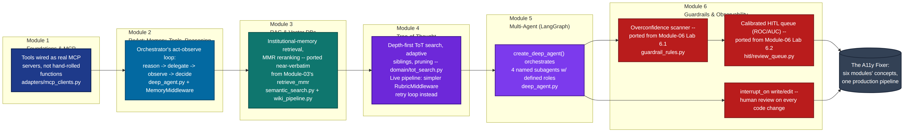

# The A11y Fixer — Module 1–6 Concepts Applied (High Level)

Every mapping in this diagram is cited directly from the agent's own source docstrings —
not inferred. Read from `cmu-capstone/agent/src/a11y_fixer/` on 2026-09-08, cross-referenced
against the course's `Module-01` through `Module-06` folders in this checkout.

```mermaid
%% The A11y Fixer -- Module 1-6 Concepts Applied (High Level)
%% Every mapping below is cited directly from the agent's own source docstrings.
%% Left-to-right layout -- deliberately wide/short so it embeds cleanly in a README.
flowchart LR
    classDef m1 fill:#1E3A8A,stroke:#0B1F4E,color:#FFFFFF,stroke-width:2px
    classDef m2 fill:#0369A1,stroke:#0C4A6E,color:#FFFFFF,stroke-width:2px
    classDef m3 fill:#0F766E,stroke:#0B4F49,color:#FFFFFF,stroke-width:2px
    classDef m4 fill:#6D28D9,stroke:#3B0F91,color:#FFFFFF,stroke-width:2px
    classDef m5 fill:#7C3AED,stroke:#4C1D95,color:#FFFFFF,stroke-width:2px
    classDef m6 fill:#B91C1C,stroke:#7F1D1D,color:#FFFFFF,stroke-width:2px
    classDef store fill:#334155,stroke:#1E293B,color:#FFFFFF,stroke-width:2px

    subgraph MOD1["Module 1<br/>Foundations &amp; MCP"]
        M1["Tools wired as real MCP<br/>servers, not hand-rolled<br/>functions<br/>adapters/mcp_clients.py"]:::m1
    end

    subgraph MOD2["Module 2<br/>ReAct: Memory, Tools, Reasoning"]
        M2["Orchestrator's act-observe loop:<br/>reason -&gt; delegate -&gt; observe -&gt; decide<br/>deep_agent.py + MemoryMiddleware"]:::m2
    end

    subgraph MOD3["Module 3<br/>RAG &amp; Vector DBs"]
        M3["Institutional-memory retrieval,<br/>MMR reranking -- ported near-verbatim<br/>from Module-03's retrieve_mmr<br/>semantic_search.py + wiki_pipeline.py"]:::m3
    end

    subgraph MOD4["Module 4<br/>Tree-of-Thought"]
        M4["Depth-first ToT search, adaptive<br/>siblings, pruning -- domain/tot_search.py<br/>Live pipeline: simpler RubricMiddleware<br/>retry loop instead"]:::m4
    end

    subgraph MOD5["Module 5<br/>Multi-Agent (LangGraph)"]
        M5["create_deep_agent() orchestrates<br/>4 named subagents w/ defined roles<br/>deep_agent.py"]:::m5
    end

    subgraph MOD6["Module 6<br/>Guardrails &amp; Observability"]
        M6a["Overconfidence scanner --<br/>ported from Module-06 Lab 6.1<br/>guardrail_rules.py"]:::m6
        M6b["Calibrated HITL queue (ROC/AUC) --<br/>ported from Module-06 Lab 6.2<br/>hitl/review_queue.py"]:::m6
        M6c["interrupt_on write/edit --<br/>human review on every code change"]:::m6
    end

    M1 --> M2 --> M3 --> M4 --> M5
    M5 --> M6a --> M6b
    M5 --> M6c

    Result[("The A11y Fixer:<br/>six modules' concepts,<br/>one production pipeline")]:::store
    M6b --> Result
    M6c --> Result
```

Diagram source (click to expand)

## Reading the diagram

| Module | Course concept | Where it lives in `a11y-fixer` |
| --- | --- | --- |
| 1 | Foundations of Agentic AI & the Model Context Protocol | Every tool the agent uses — WCAG lookups, Angular CLI, browser control — is wired as a real MCP server (`adapters/mcp_clients.py`), not a hand-written function call. |
| 2 | The ReAct framework: memory, tools, reasoning | The top-level orchestrator's system prompt enforces a strict reason → delegate → observe → decide loop, and `MemoryMiddleware` loads `wiki/AGENTS.md` as working memory before each run. |
| 3 | RAG agents & vector databases | Institutional memory (lessons from past human rejections) is retrieved with MMR reranking — the code comment says this is ported "near-verbatim" from Module 3's own hybrid-retrieval demo. |
| 4 | Tree-of-Thought reasoning & agentic harnesses | `domain/tot_search.py` implements a real depth-first ToT search with adaptive sibling inflation and pruning. It's still used for offline benchmark scoring; the live pipeline now uses a simpler, proven `RubricMiddleware` retry loop instead — a deliberate, documented trade-off, not an oversight. |
| 5 | Multi-agent workflows with LangGraph | `create_deep_agent()` composes four named subagents (planner, compiler, critic, crawler) into one coordinated graph with explicit hand-offs. |
| 6 | Evaluation, guardrails, logging & observability | The overconfidence scanner and the calibrated (ROC/AUC) human-review queue are both explicitly ported from Module 6's own labs, and `interrupt_on` pauses the graph for human approval on every single file write. |

**Verified:** rendered locally via `@mermaid-js/mermaid-cli` against a real headless Chromium — the actual render output, not a mockup. Laid out left-to-right (rather than the original top-to-bottom) specifically so it embeds at a reasonable height in a README instead of towering over the page.
