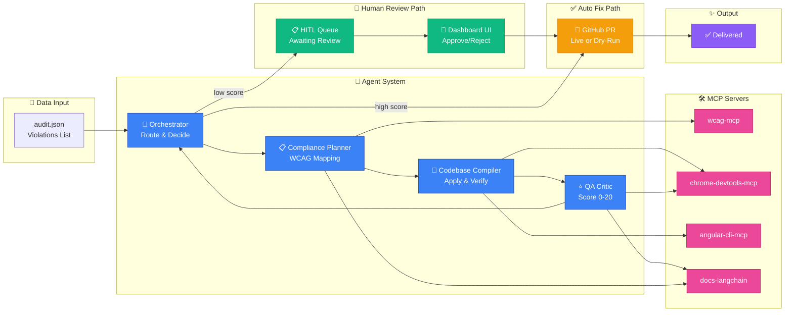
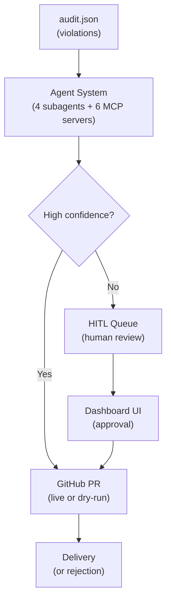

# A11y Fixer — Capstone Project Architecture

## System Overview

## High-Level Flow

### 1️⃣ **Audit & Discovery**
- GitHub Actions or CLI trigger → scans Angular app with axe-core
- Creates `audit.json` with violation list

### 2️⃣ **User Interface Layer**
Three complementary dashboards:
- **Main Dashboard**: Overview of all violations, filterable by WCAG level
- **HITL Queue**: Violations awaiting human approval
- **Lessons**: Knowledge base from fixed violations

### 3️⃣ **Agent Intelligence**
Four subagents work together:
- **Compliance Planner**: Maps violations to WCAG rules via wcag-mcp
- **Codebase Compiler**: Applies patches, runs tests via angular-cli-mcp
- **QA Critic**: Scores fixes 0-20 using Chrome DevTools analysis
- **Orchestrator**: Routes to auto-fix or human review based on score

### 4️⃣ **External Integrations**
- **WCAG MCP**: Real-time WCAG rule lookups (never training data)
- **Chrome DevTools MCP**: Visual stability & rendering validation
- **Angular CLI MCP**: Build, test, and verify patches
- **LangChain Docs MCP**: Reference documentation for compliance

### 5️⃣ **Delivery**
- **Auto Fix Route**: High-confidence fixes → GitHub PR creation
- **Human Review Route**: Low-confidence fixes → HITL queue for approval

## Key Design Principles

✅ **Multi-Agent Coordination** — 4 subagents + 6 MCP servers work in concert
✅ **Iterative Refinement** — If QA score is low, loop back to Compliance Planner
✅ **Real-Time WCAG** — Never rely on training data; always query wcag-mcp
✅ **Human-in-the-Loop** — Uncertain fixes go to HITL queue for approval
✅ **End-to-End Validation** — Build, test, visual analysis before delivery

## Data Flow

