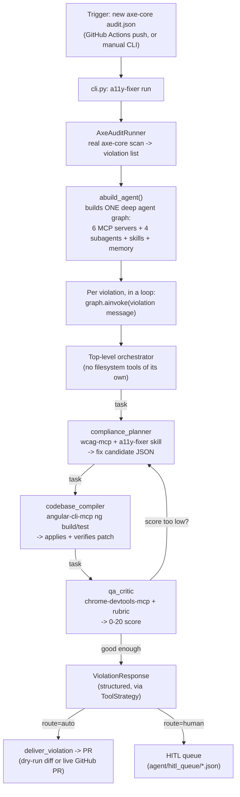

## The A11y Fixer — end-to-end flow

**Step by step:**

1. **Trigger** — either a GitHub Actions push (per `a11y-fixer.yml`, watching for a new `audit.json`) or a manual `a11y-fixer run` / `a11y-fixer audit` CLI call. `--repo <url-or-path>` lets it target any Angular repo, not just the bundled `Hallucinate.io` fixture.

2. **Audit** — `AxeAuditRunner` spins up `ng serve`, runs real `@axe-core/cli` against every page, and normalizes the result into a flat list of violations (rule, page, selector, failing HTML).

3. **Build the agent (once)** — `abuild_agent()` connects to 6 MCP servers (wcag, chrome-devtools, angular-cli, playwright, docs-langchain, reference-langchain), assembles 4 subagent specs, loads the `a11y-fixer` skill (the WCAG rule→technique mapping) and the institutional-memory wiki, and compiles one LangGraph deep agent — the same graph is reused for every violation, just with a fresh thread ID each time.

4. **Per violation** — the orchestrator gets a plain-text description of one violation and must delegate through all three subagents in order (this is the part that took the whole session to get reliably working):
   - **`compliance_planner`** queries `wcag-mcp` live (never relies on training data) to map the axe rule to a WCAG success criterion and pick a sufficient technique, producing a fix candidate.
   - **`codebase_compiler`** actually applies the patch and runs `ng build`/`ng test` via the Angular CLI MCP to verify it compiles and passes.
   - **`qa_critic`** scores the candidate 0–20 using a deterministic half (build pass, visual stability via Chrome DevTools traces) and an LLM-judgment half (does it truly satisfy the WCAG criterion's intent).
   - If the score is weak, the orchestrator can loop back to `compliance_planner` for another attempt — this iterative refinement is exactly what we saw happen in the successful run.

5. **Structured decision** — the orchestrator combines the critic's score with its own confidence into a final `ViolationResponse` (`route: "auto"` or `"human"`). This is now forced through `ToolStrategy` rather than the provider's native structured-output mode, which is the fix that made this reliable.

6. **Delivery** — `route: "auto"` diffs the fixture's git working tree and either opens a real PR (GitHub REST API, if `GITHUB_TOKEN` is set and `--live`) or writes a dry-run diff to disk; `route: "human"` writes the candidate to a filesystem-backed review queue instead. Any `write_file`/`edit_file` call from `codebase_compiler` pauses for human approval (HITL) unless auto-approved.

7. **Resilience** — each violation runs in its own try/except in the CLI loop, so one failure never aborts the batch; there's also a separate `evaluation/run_eval.py` harness that runs the same pipeline against the 22-case benchmark and computes real HELM-style metrics (clearance rate, calibration error, etc.) instead of the plan's original placeholder numbers.