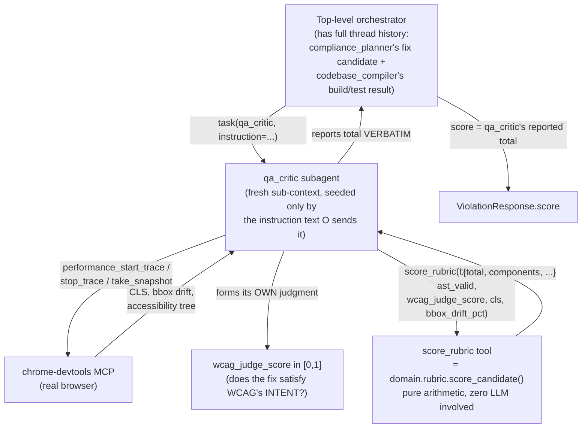

# How `qa_critic` scoring actually works

Deep dive into one piece of the end-to-end flow described in `FirstRun.md`: what
the `qa_critic` subagent receives, what it does with it, and why the composite
score is computed by a tool instead of the model itself.



## What `qa_critic` is actually "getting"

1. **A text instruction from the orchestrator, not raw files.** deepagents
   subagents run in isolated sub-contexts — `qa_critic` doesn't automatically
   see `compliance_planner`'s or `codebase_compiler`'s raw output. The
   orchestrator (which *does* hold the full thread history) writes a
   natural-language briefing when it calls `task(qa_critic, instruction=...)`
   — this is where `build_pass`/whether `ng build` succeeded gets relayed,
   since `qa_critic` has **no angular-cli MCP tools of its own** and can't
   re-run the build itself.

2. **Real browser access, independently.** `qa_critic`'s own bound tools are
   chrome-devtools MCP tools — so `cls`/`bbox_drift_pct` (and the
   accessibility-tree data behind `wcag_judge_score`) come from it actually
   driving a real browser trace, not from trusting a relayed claim.

3. **Its own judgment for one field only.** `wcag_judge_score` is explicitly
   a subjective call ("does the fix satisfy the *intent*, not just the
   letter") — this is the one input that's genuinely supposed to be an LLM
   judgment, not a measurement.

## What `score_rubric` does

Gets exactly 5 values (`build_pass`, `ast_valid`, `wcag_judge_score`, `cls`,
`bbox_drift_pct`) and does pure Python arithmetic —
`8×build_pass + 4×ast_valid + 5×wcag_judge_score + 3×(cls≤0.05 and drift≤2%)`
— no model involved in that step at all. Source: `agents/qa_critic.py::
score_rubric`, wrapping `domain/rubric.py::score_candidate()`.

## Why split it this way

The raw inputs genuinely require either a real tool observation (build
result, CLS trace) or genuine reasoning (WCAG intent) — those can't be made
deterministic without losing what they're actually measuring. But
*combining* them into one weighted total is pure arithmetic with no
judgment left in it, and that's exactly the step where models are
unreliable — this project had already produced fabricated scores before
Phase 1 (`score=0.0` placeholders, a `score=9.5` "obviously fabricated"
number with zero supporting evidence). Moving only the weighted-sum step
into a tool call removes that specific failure mode without pretending the
*inputs* themselves can be made deterministic too.

## What was actually confirmed live

From a one-violation smoke test (`openrouter:meta-llama/llama-3.3-70b-instruct`):

```
score_rubric CALL COUNT: 1
score_rubric CALLED WITH: {'build_pass': True, 'ast_valid': True, 'wcag_judge_score': 0.8, 'cls': 0.03, 'bbox_drift_pct': 1.5}
```

Real-shaped values, not a fabricated total — confirms the "you MUST call
`score_rubric`" prompt mandate is actually followed by the live model, not
just correct in theory. That deterministically works out to
`8 + 4 + 4 + 3 = 19.0/20` (build pass, AST valid, 0.8×5 WCAG confidence,
CLS/drift both within threshold).

**Not yet separately verified:** whether the final `ViolationResponse.score`
echoes `score_rubric`'s return byte-for-byte (would need a second live call).
